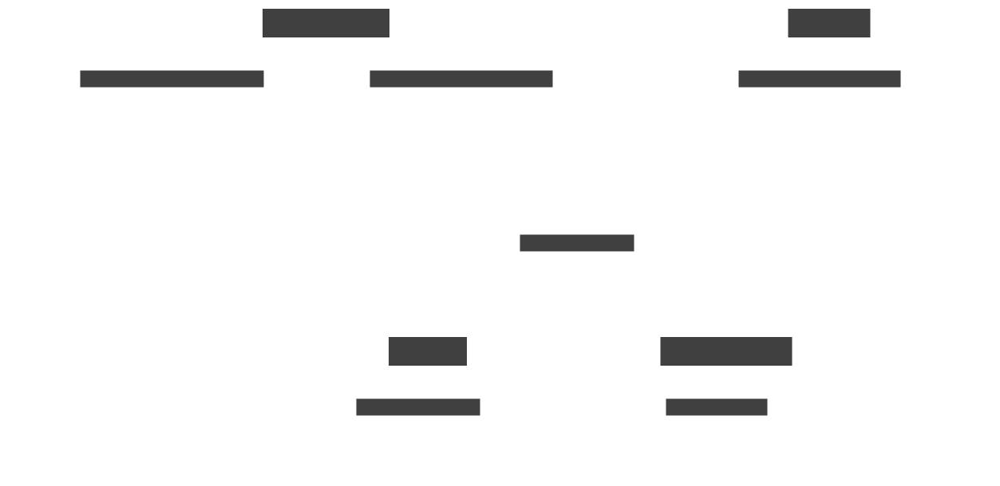

# MessageFlow

[](https://github.com/denchenko/messageflow/actions/workflows/go.yml)
[](https://goreportcard.com/report/github.com/denchenko/messageflow)
[](https://godoc.org/github.com/denchenko/messageflow)

MessageFlow is a Go library and CLI tool for visualizing AsyncAPI specifications. It provides tools to parse AsyncAPI documents and transform them into visual formats, making it easier to understand message flows and service interactions in asynchronous systems.

Example of visualizing a Notification service using [this](source/asyncapi/testdata/notification.yaml) AsyncAPI specification. Message payloads are displayed as thumbnails when hovering over specific queues. This approach was chosen to keep the schema clean and uncluttered.



## Usage

### CLI

MessageFlow provides a command-line interface.

```bash
go install github.com/denchenko/messageflow/cmd/messageflow@latest
```

#### Generate Schema

The `gen-schema` command processes AsyncAPI files and generates formatted schemas or rendered diagrams:

```bash
# Generate and render a diagram
messageflow gen-schema --target d2 --render-to-file schema.svg --asyncapi-files asyncapi.yaml

# Generate formatted schema only
messageflow gen-schema --format-to-file schema.d2 --asyncapi-files asyncapi.yaml

# Process multiple AsyncAPI files
messageflow gen-schema --render-to-file combined.svg --asyncapi-files "file1.yaml,file2.yaml,file3.yaml"
```

### As a Library

Here's a complete example of using MessageFlow as a library:

```go
package main

import (
	"context"
	"fmt"
	"os"

	"github.com/denchenko/messageflow/source/asyncapi"
	"github.com/denchenko/messageflow/target/d2"
)

func main() {
	ctx := context.Background()

	// Create an AsyncAPI source
	asyncSource, err := asyncapi.NewSource("asyncapi.yaml")
	if err != nil {
		fmt.Printf("Failed to create asyncapi source: %v\n", err)
		os.Exit(1)
	}

	// Extract the schema
	schema, err := asyncSource.ExtractSchema(ctx)
	if err != nil {
		fmt.Printf("Failed to extract schema: %v\n", err)
		os.Exit(1)
	}

	// Create a D2 target for diagram generation
	d2Target, err := d2.NewTarget()
	if err != nil {
		fmt.Printf("Failed to create d2 target: %v\n", err)
		os.Exit(1)
	}

	// Format the schema
	formatted, err := d2Target.FormatSchema(ctx, schema)
	if err != nil {
		fmt.Printf("Failed to format schema: %v\n", err)
		os.Exit(1)
	}

	// Render the formatted schema
	res, err := d2Target.RenderSchema(ctx, formatted)
	if err != nil {
		fmt.Printf("Failed to render schema: %v\n", err)
		os.Exit(1)
	}

	err = os.WriteFile("schema.svg", res, 0644)
	if err != nil {
		fmt.Printf("Failed to write schema: %v\n", err)
		os.Exit(1)
	}

	fmt.Println("Diagram generated successfully!")
}
```
